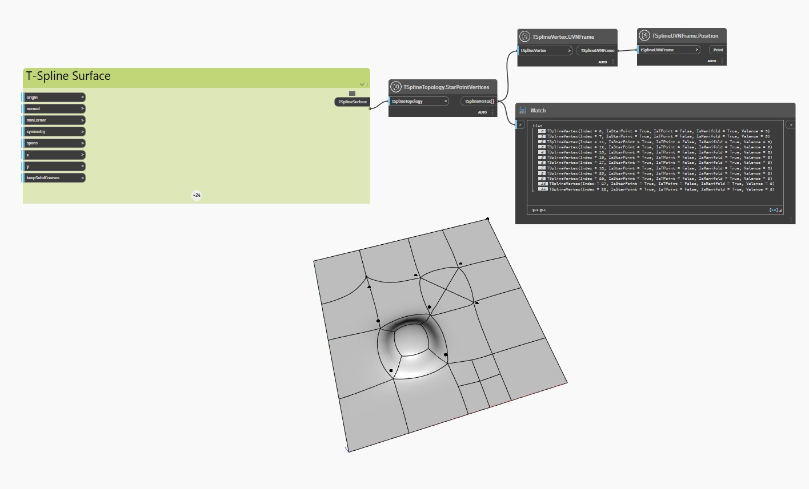

<!--- Autodesk.DesignScript.Geometry.TSpline.TSplineTopology.StarPointVertices --->
<!--- RMKGTFPZFLM5GGB475DWTHXFTJCBZQXE2HEVNUZA6OS72LH53HVQ --->
## 詳細
次の例では、押し出され、再分割され、プルされた頂点と面を持つ平面 T スプライン サーフェスについて、その頂点がスター ポイントであるかどうかを確認するために `TSplineTopology.StarPointVertices` ノードで検査されます。

ノード `TSplineVertex.UVNFrame` と `TSplineUVNFrame.Position` は、サーフェスのスター ポイントをハイライト表示するために使用されます。
___
## サンプル ファイル

