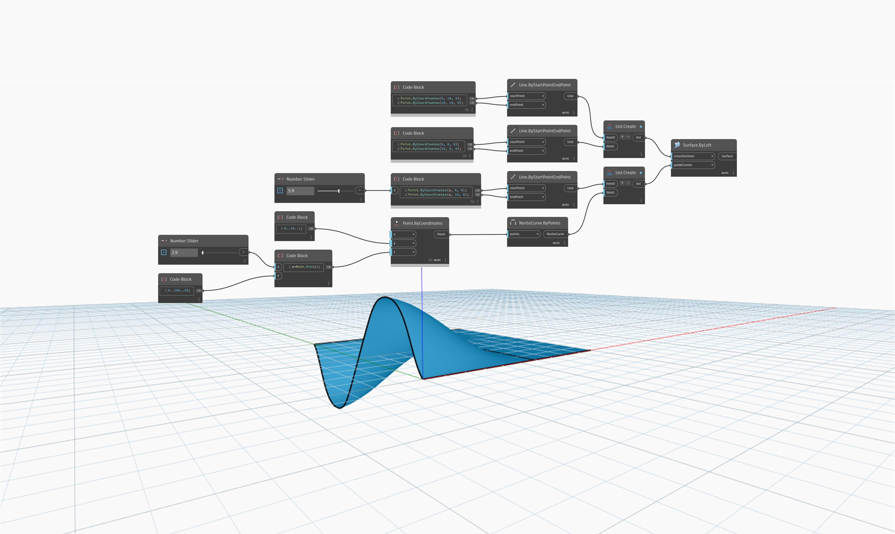

<!--- Autodesk.DesignScript.Geometry.Surface.ByLoft(crossSections, guideCurves) --->
<!--- SINCXSXBHUIGJR3UTLPZRANLRDQTQ7J3YRTX5LDDY2BOYA4F6XYQ --->
## 詳細
`Surface.ByLoft (crossSections, guideCurves)` は、間をロフトする断面のリストと、ロフトのプロファイルを決定するガイド曲線の別のリストを取得します。

次の例では、2 つの直線を入力断面として使用します。ガイド曲線として、1 つの正弦曲線と 1 つの直線を作成します。数値スライダでこの正弦曲線と直線間の距離をコントロールします。その結果、正弦曲線と直線を補間するロフトが生成されます。

___
## サンプル ファイル

