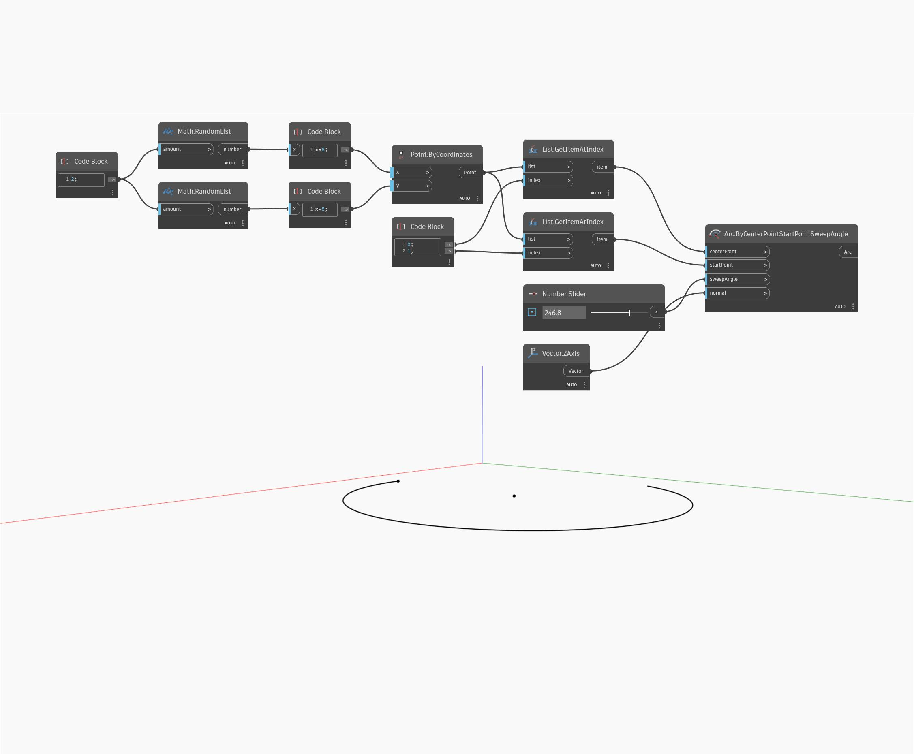

<!--- Autodesk.DesignScript.Geometry.Arc.ByCenterPointStartPointSweepAngle --->
<!--- T4ELVGYIGJW62SQ52OSQTHK7FD4HPDADDXLQ3W54SUACRRXKXZGQ --->
## 詳細
Arc.ByCenterPointStartPointSweepAngle は、指定された Sweep Angle を使用して Center Point を中心に円弧を作成します。Start Point は、円弧の描画を開始する場所を Dynamo に指示します。次の例では、ランダムに生成された点を中心に円弧が描画されています。
___
## サンプル ファイル

