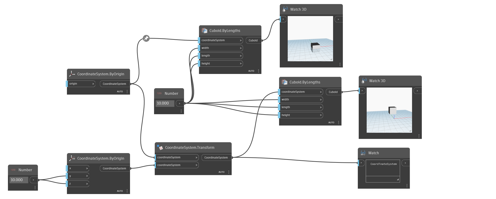

<!--- Autodesk.DesignScript.Geometry.CoordinateSystem.Transform(coordinateSystem, coordinateSystem) --->
<!--- U3C6XW5LVP2GS44OR67HZ43LHZHFNTYHMHG6X7YOGZMPS52CMXAA --->
## 詳細
CoordinateSystem.Transform は、指定した CoordinateSystem を別の座標系で変換します。
___
## サンプル ファイル

