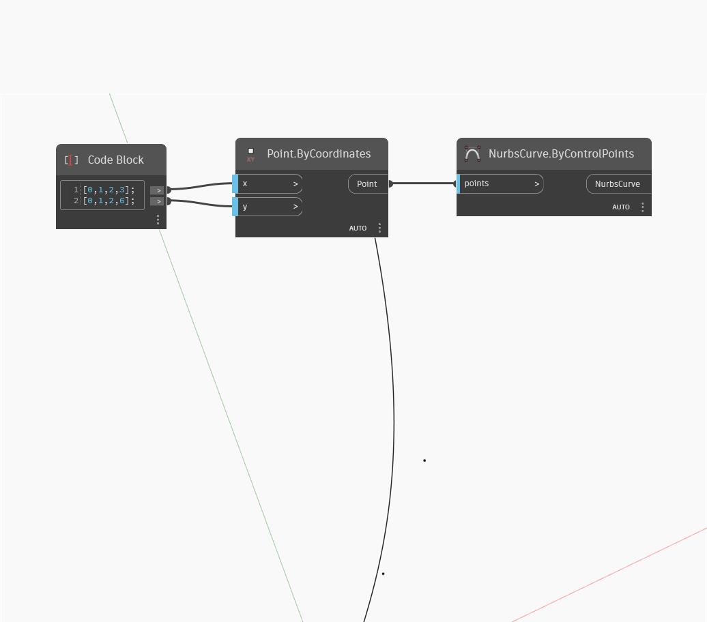

<!--- Autodesk.DesignScript.Geometry.NurbsCurve.ByControlPoints(points) --->
<!--- UBBQRVGE4HKFTNK4OFRC7ZXLV26MFZNZQZQ5FXSM3ABCG36L4XBQ --->
## 詳細
NurbsCurve.ByControlPoints は、制御点として使用する点のリストを入力し、NurbsCurve を出力します。次の例では、Code Block を使用して、一連の点の X と Y の位置に対応する 2 つのリストを生成します。この点群が NurbsCurve の描画に使用されています。
___
## サンプル ファイル

