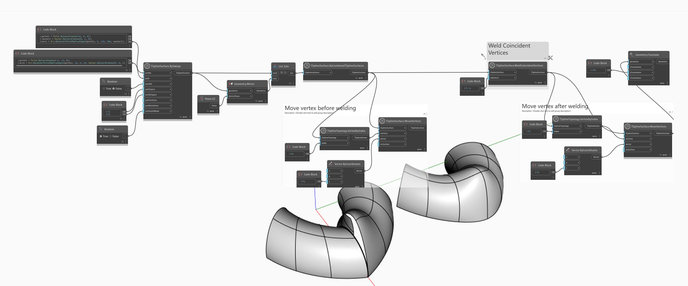

<!--- Autodesk.DesignScript.Geometry.TSpline.TSplineSurface.WeldCoincidentVertices --->
<!--- UZA22A4OYIXSIP3U5CUGNZ3WBDHIEMOS2MYI5GKTJJJFBTGI5JTA --->
## 詳細
次の例では、`TSplineSurface.ByCombinedTSplineSurfaces` ノードを使用して T スプライン サーフェスの 2 つの部分を 1 つに結合します。鏡像複写面に沿った頂点はオーバーラップしており、`TSplineSurface.MoveVertices` ノードを使用して頂点を 1 つ移動すると表示されます。これを修復するには、`TSplineSurface.WeldCoincidentVertices` ノードを使用して、連結を実行します。頂点の移動の結果が変わり、プレビューを見やすくするために横に移動されます。
___
## サンプル ファイル

