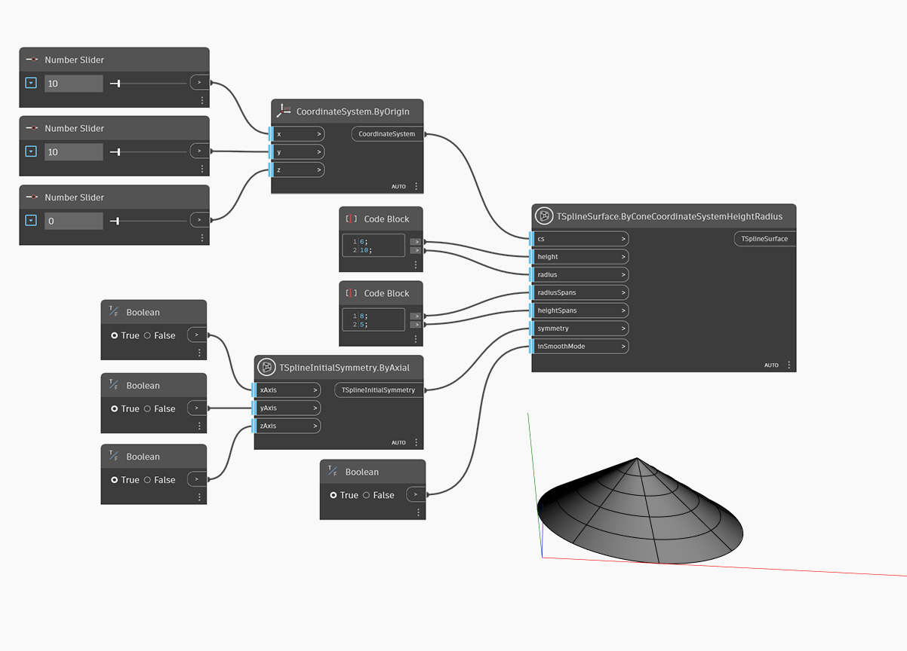

<!--- Autodesk.DesignScript.Geometry.TSpline.TSplineSurface.ByConeCoordinateSystemHeightRadius --->
<!--- WG4273QZLTXFNOZTJWMFHD4JKB67IIQBJCQNC5SMOC43VJNXKACA --->
## In-Depth
次の例では、`cs` 入力で定義された座標系の原点に底面を配置して円錐を作成します。円錐のサイズは `height` および `radius` で定義します。放射方向と高さ方向のスパンは `radiusSpans` および `heightSpans` 入力でコントロールします。形状の初期対称性は `symmetry` 入力で指定します。X または Y 対称を True に設定する場合は、放射方向のスパンの値を 4 の倍数にする必要があります。最後に、`inSmoothMode` 入力を使用して、T スプライン サーフェスのスムーズ モードとボックス モードのプレビューを切り替えます。

## サンプル ファイル

