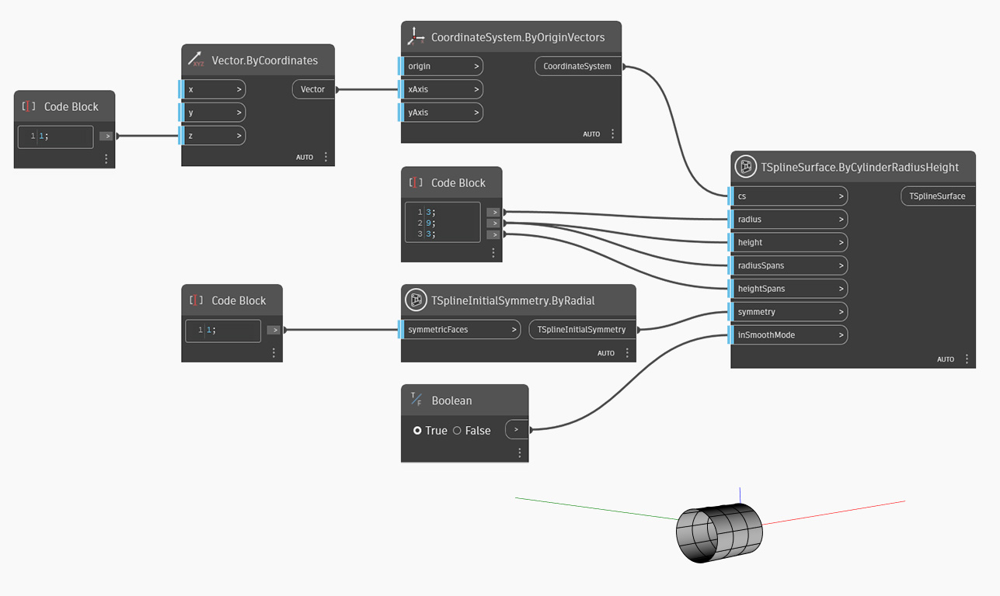

<!--- Autodesk.DesignScript.Geometry.TSpline.TSplineSurface.ByCylinderRadiusHeight --->
<!--- WGMB4D4GWPYAS6YAOVBQIXYPGCBRH3KEF437CWWZGSXVEZXLRGTQ --->
## In-Depth
次の例では、T スプライン プリミティブの円柱サーフェスを作成します。円柱の位置と方向は、`cs` 入力の座標系で定義します。`radius` および `height` の値は円柱のサイズを設定します。放射方向と高さ方向のスパンは `radiusSpans` および `heightSpans` 入力でコントロールします。形状の初期対称性は `symmetry` 入力で指定します。X または Y 対称を True に設定する場合は、放射方向のスパンの値を 4 の倍数にする必要があります。最後に、`inSmoothMode` 入力を使用して、T スプライン サーフェスのスムーズ モードとボックス モードのプレビューを切り替えます。

## サンプル ファイル

