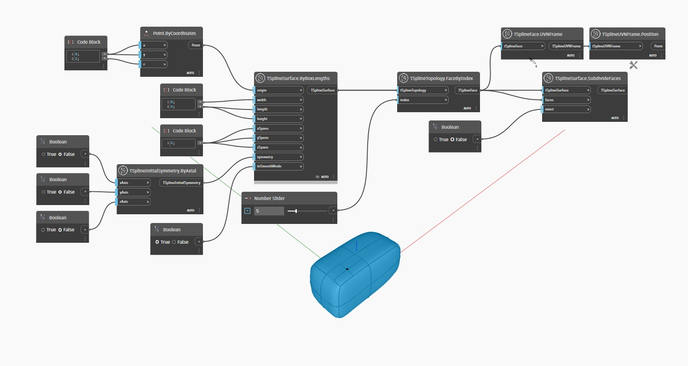

<!--- Autodesk.DesignScript.Geometry.TSpline.TSplineSurface.SubdivideFaces --->
<!--- WKY3SVAE74IVMZW7MVT4F5TGIUFXAGA2W2FN6Q6PACG3NH6AMVFA --->
## 詳細
次の例では、`TSplineSurface.ByBoxLengths` ノードを使用して T スプライン サーフェスが生成されます。
面は `TSplineTopology.FaceByIndex` ノードを使用して選択され、`TSplineSurface.SubdivideFaces` ノードを使用して再分割されます。
このノードは、指定された面を、通常の面の場合は 4 つ、多角形の場合は 3 つまたは 5 つ以上の小さい面に分割します。
`exact` のブール値入力が true に設定されている場合、再分割を追加する際に元の形状とまったく同じ形状を維持しようとするサーフェスが生成されます。形状を保持するためにさらにアイソカーブが追加される場合もあります。false に設定されている場合、ノードは選択した 1 つの面のみを再分割するため、元のサーフェスとは異なるサーフェスになることがよくあります。
ノード `TSplineFace.UVNFrame` と `TSplineUVNFrame.Position` は、再分割する面の中心をハイライト表示するために使用されます。
___
## サンプル ファイル

