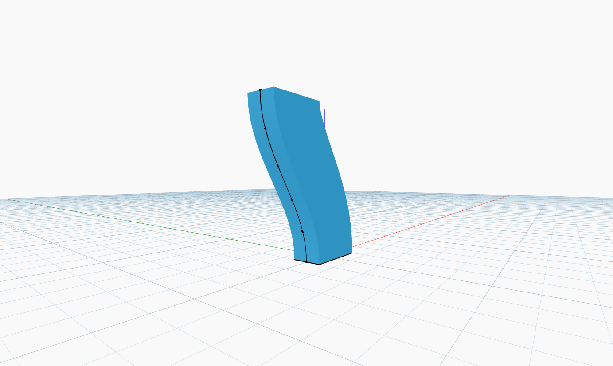

<!--- Autodesk.DesignScript.Geometry.Solid.BySweep(profile, path, cutEndOff) --->
<!--- X65A3XAWWVM3XWMAZHZFLL5HTXCJAGYISLC4VHRMPHEV3MBYIRXQ --->
## 詳細
`Solid.BySweep` は、入力された閉じたプロファイル曲線を指定されたパスに沿ってスイープして、サーフェスを作成します。

次の例では、長方形を基準のプロファイル曲線として使用します。パスの作成には余弦関数を使用し、角度のシーケンスで点のセットの X 座標を変化させます。点郡は、`NurbsCurve.ByPoints` ノードへの入力として使用されます。次に、作成された余弦曲線に沿って長方形をスイープして、ソリッドを作成します。
___
## サンプル ファイル

