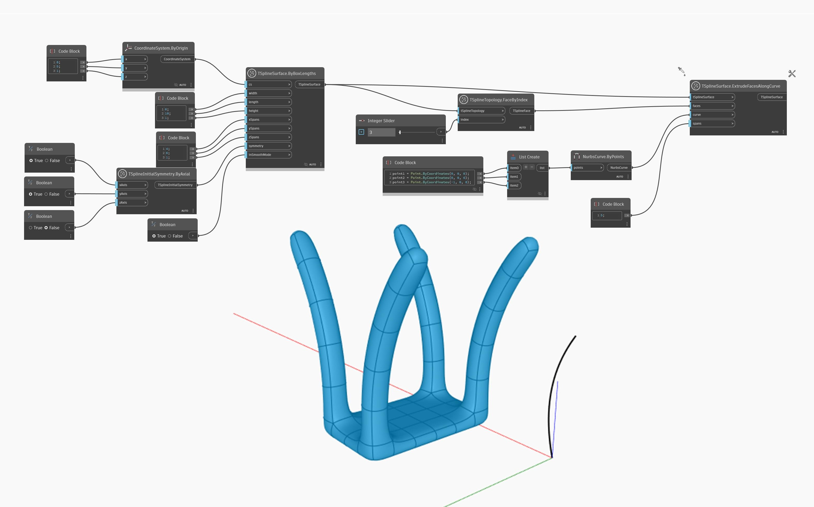

<!--- Autodesk.DesignScript.Geometry.TSpline.TSplineSurface.ExtrudeFacesAlongCurve --->
<!--- XTER6KGCJ3OP43RH5L4IEBVIW7JTSDB46DYI7BVE2UMG3DXB7HLQ --->
## 詳細
次の例では、`TSplineTopology.FaceByIndex` ノードを使用してボックス T スプライン サーフェスの単一の面を選択します。次に、`TSplineSurface.ExtrudeFacesAlongCurve` ノードを使用して、面は指定された `curve` に従って押し出されます。その結果は、4 つの押し出された面を持つ形状になります。これは、形状に初期対称性が適用されているためです。
___
## サンプル ファイル

