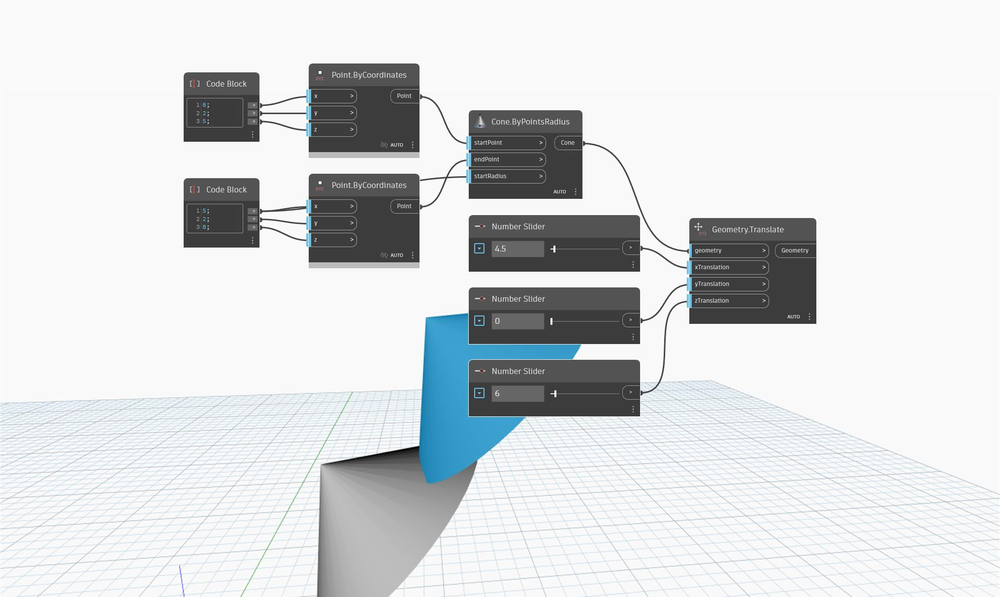

<!--- Autodesk.DesignScript.Geometry.Geometry.Translate(geometry, xtranslation, ytranslation, ztranslation) --->
<!--- Z7RCGSZ7PG327WNJNF5LAVZMVCYSSBNPUFE666HLMLY4QCDT4TDQ --->
## 詳細
`Geometry.Translate (xTranslation, yTranslation, zTranslation)` は、指定された変位に従い、X、Y、Z 軸に沿って入力されたジオメトリを移動します。

次の例では、数値スライダでコントロールした距離だけ、円錐が X 軸と Z 軸の方向に移動します。
___
## サンプル ファイル

