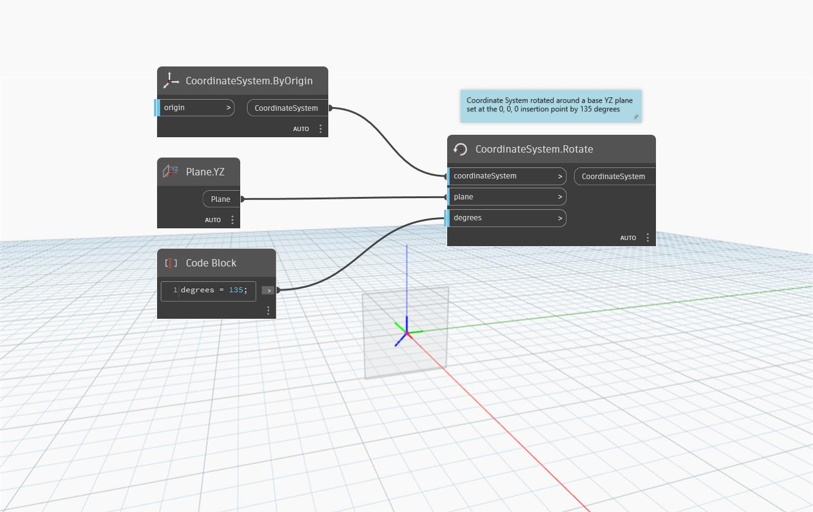

<!--- Autodesk.DesignScript.Geometry.CoordinateSystem.Rotate(coordinateSystem, plane, degrees) --->
<!--- ZF4ATQU6FEYXLGNLBEREZ7EQLGEQUAOWM5PGJ2LCQJBV3EEJUIPQ --->
## 詳細
`CoordinateSystem.Rotate (coordinateSystem, plane, degrees)` は、指定された角度の数値だけ平面を中心に回転させた新しい CoordinateSystem を返します。

次の例では、座標系は、挿入点(0、0、0)に設定された基準 YZ 平面を中心に 135 度回転します。

___
## サンプル ファイル

