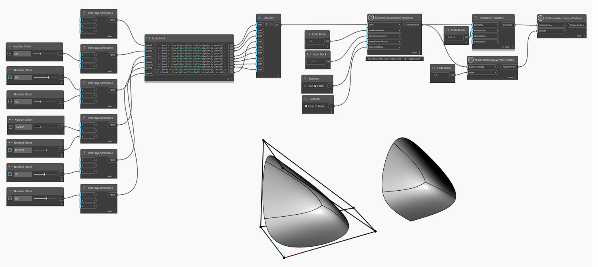

<!--- Autodesk.DesignScript.Geometry.TSpline.TSplineSurface.CreaseVertices --->
<!--- ZLORG7PG4XWDBYXJHH7YVPDCIU4QYMZWAMABFPVWNAZ7VTQTX2YQ --->
## In-Depth
次の例では、`TSplineSurface.BuildFromLines` ノードを使用し、`creaseOuterVertices` 入力を False に設定して、折り目のないエッジを持つ形状を作成します。インデックス 1 の頂点は `TSplineSurface.CreaseVertices` ノードを使用して折り目を付けられ、見やすくするために形状は右側に移動されます。

## サンプル ファイル

