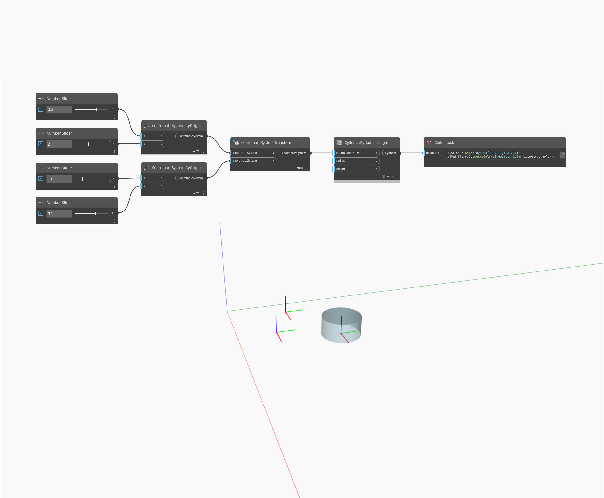

<!--- Autodesk.DesignScript.Geometry.CoordinateSystem.Transform(coordinateSystem, fromCoordinateSystem, contextCoordinateSystem) --->
<!--- 43XHCR2GSF5A34R3G2P7OGOWDWYKS3WCXART33FSES5M5ZF2MHJA --->
## 상세
CoordinateSystem.Transform은 지정된 좌표계를 소스 좌표계에서 새 좌표계로 변환합니다.
___
## 예제 파일

