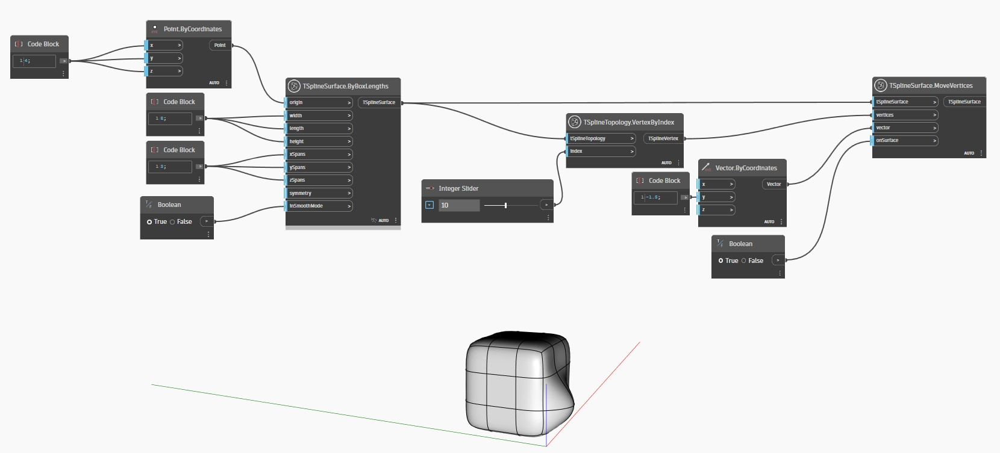

<!--- Autodesk.DesignScript.Geometry.TSpline.TSplineTopology.VertexByIndex --->
<!--- 7LRWGLADXMQPJN33WBBRTYBBK4NO6FQADRQICYVBDCTWPJ3FOONQ --->
## 상세
아래 예에서는 T-Spline 표면의 정점이 `TSplineTopology.VertexByIndex` 노드를 사용하여 수집됩니다. 그런 다음 정점이 `TSplineSurface.MoveVertices` 노드의 입력으로 사용됩니다.
___
## 예제 파일

