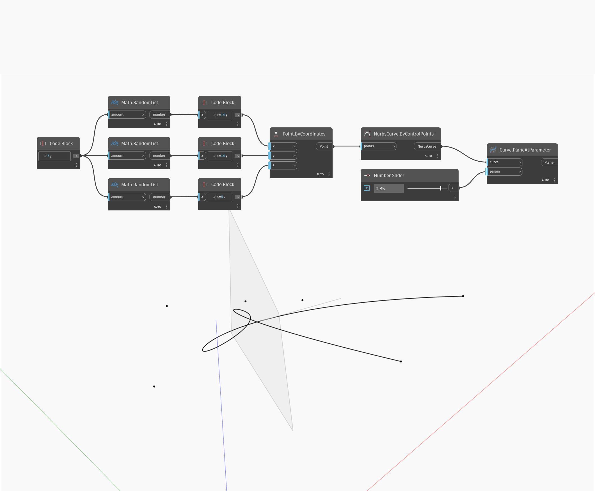

## 상세
Plane At Parameter는 지정된 매개변수에서 곡선에 정렬된 평면을 반환합니다. 결과 평면의 법선 벡터는 곡선의 접선에 해당합니다. 곡선의 매개변수화는 0~1 범위로 측정되며 0은 곡선의 시작을 나타내고 1은 곡선의 끝을 나타냅니다. 아래 예에서는 먼저 임의로 생성된 점 세트를 입력으로 사용하여 ByControlPoints 노드로 Nurbs 곡선을 작성합니다. 0~1 범위로 설정된 숫자 슬라이더를 사용하여 PlaneAtParameter 노드에 대한 매개변수 입력을 제어합니다.
___
## 예제 파일

