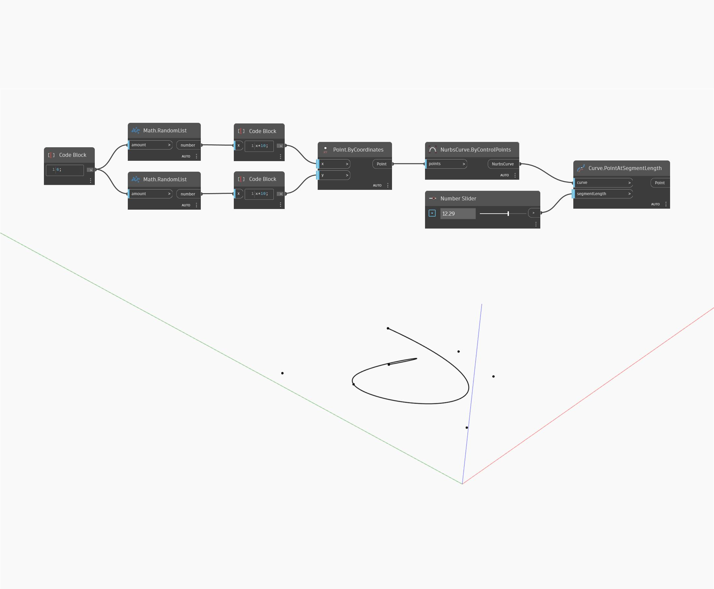

## 상세
Point At Segment Length는 곡선의 시작점에서 측정된 곡선을 따라 지정된 길이에 곡선 위의 점을 반환합니다. 입력 길이가 곡선의 길이보다 크면 이 노드는 곡선의 끝점을 반환합니다. 아래 예에서는 두 세트의 임의의 숫자를 사용하여 점 리스트를 생성합니다. 이러한 점은 Nurbs Curve by Control Points를 작성하는 데 사용됩니다. 숫자 슬라이더는 Point At Segment Length 노드에 대한 입력 길이로 사용됩니다.
___
## 예제 파일

