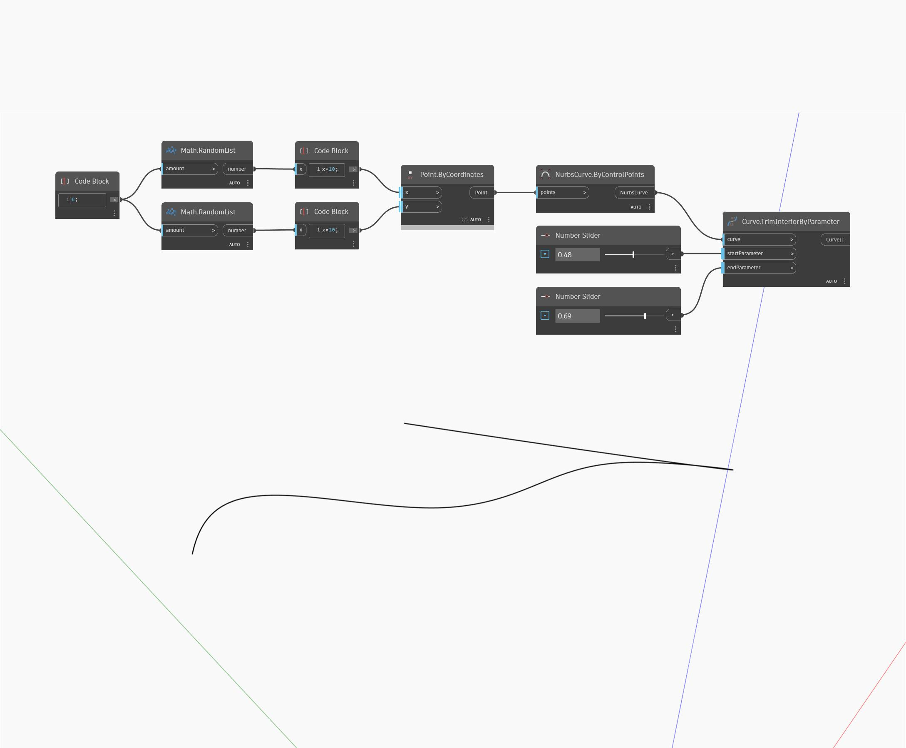

## 상세
Trim Interior By Parameter는 입력 매개변수 두 개를 기준으로 지정된 곡선의 내부 부분을 제거합니다. 이 노드는 곡선의 나머지 외부 부분 두 개를 곡선 리스트 두 개로 출력합니다. 아래 예에서는 임의의 숫자 세트 두 개를 사용하여 점 리스트를 생성합니다. 이러한 점은 Nurbs Curve by Control Points를 작성하는 데 사용됩니다. 0~1 범위로 설정된 숫자 슬라이더 두 개는 TrimInteriorByParameter 노드에 매개변수를 입력하는 데 사용됩니다.
___
## 예제 파일

