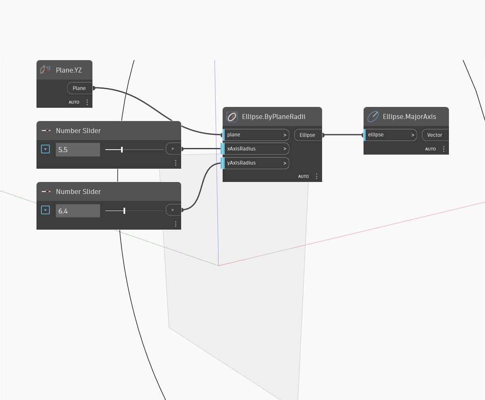

## 상세
Major Axis는 타원의 두 축 중 더 긴 축을 반환합니다. 축은 벡터로 출력되며 이 벡터의 크기는 두 반지름 중 더 큰 값입니다. 장축과 단축은 방향이 아니라 길이에 의해 결정됩니다. 즉, 장축은 타원 하나의 xAxisRadius에 해당하지만 다른 타원의 yAxisRadius에 해당할 수도 있습니다. 이 예에서는 먼저 XY 평면 및 일련의 숫자 슬라이더를 사용하여 타원 호를 작성합니다. 그런 다음 장축을 사용하여 타원의 장축을 추출합니다.
___
## 예제 파일

