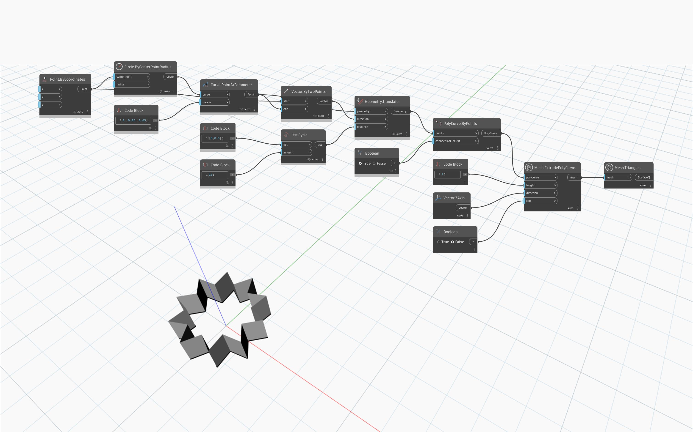

## 상세
`Mesh.ExtrudePolyCurve` 노드는 `height` 입력으로 설정된 지정된 거리와 지정된 벡터 방향으로 제공된 `polycurve`를 돌출시킵니다. 열린 PolyCurve는 첫 번째 점을 마지막 점에 연결하면 닫힙니다. 초기 `polycurve`가 평면형이고 자체 교차하지 않는 경우 생성된 메쉬는 끝을 닫아서 솔리드 메쉬를 형성할 수 있습니다.
아래 예제에서는 `Mesh.ExtrudePolyCurve`를 사용하여 닫힌 PolyCurve를 기반으로 닫힌 메쉬를 만듭니다.

## 예제 파일

