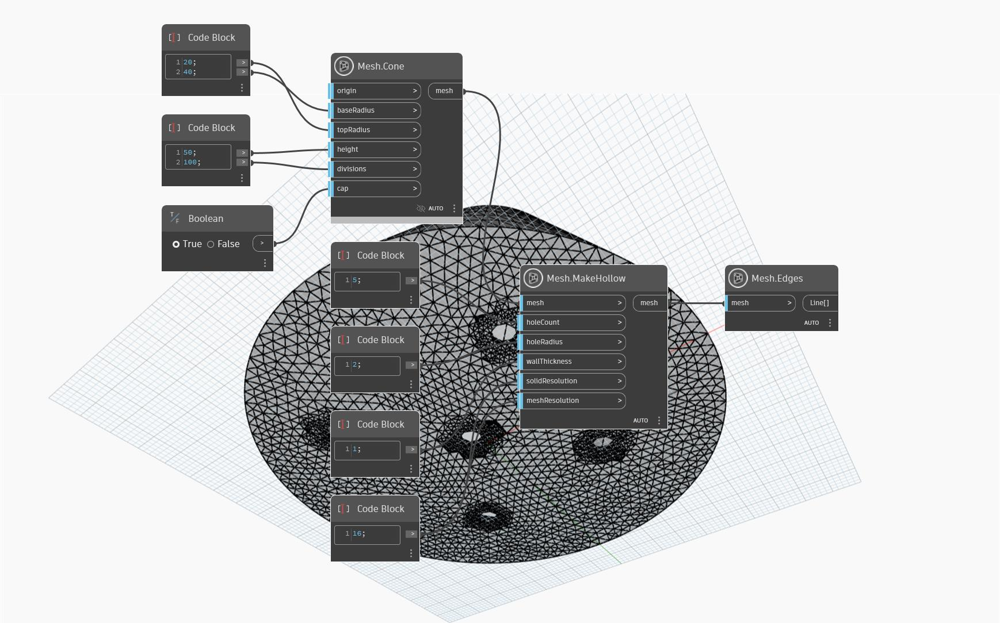

## 상세
`Mesh.MakeHollow` 연산은 3D 인쇄를 준비하기 위해 메쉬 객체의 속을 비우는 데 사용할 수 있습니다. 메쉬를 속을 비우면 필요한 인쇄 재료의 양, 인쇄 시간 및 비용을 크게 줄일 수 있습니다. `wallThickness` 입력은 메쉬 객체의 벽 두께를 정의합니다. 선택적으로 `Mesh.MakeHollow`는 인쇄 과정에서 잉여 재료를 제거하기 위한 탈출 구멍을 생성할 수 있습니다. 구멍의 크기와 개수는 입력 `holeCount`와 `holeRadius`에 의해 제어됩니다. 마지막으로, `meshResolution`과 `solidResolution`에 대한 입력은 메쉬 결과의 해상도에 영향을 미칩니다. `meshResolution`가 높을수록 메쉬의 내부 부분과 원래 메쉬 간 간격띄우기의 정확도가 향상되지만 더 많은 삼각형이 생성됩니다. `solidResolution`가 높을수록 속이 빈 메쉬의 내부 부분에서 원래 메쉬의 세부 사항이 세밀하게 유지되는 정도가 향상됩니다.
아래 예제에서 `Mesh.MakeHollow`는 원추 모양의 메쉬에 사용됩니다. 밑면에 5개의 탈출 구멍이 추가됩니다.

## 예제 파일

