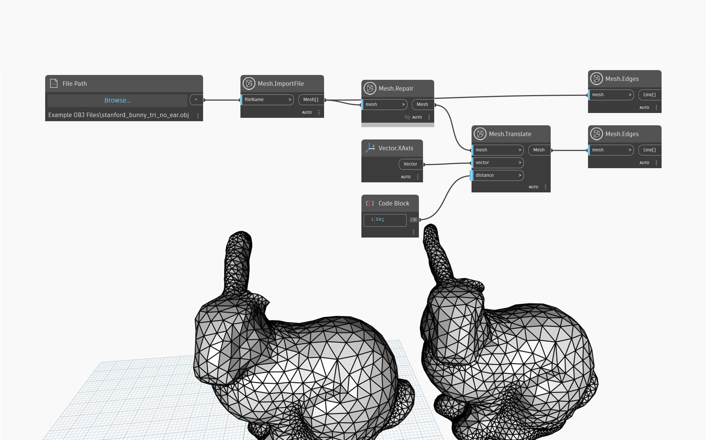

## 상세
다음 결함이 수정된 새 메쉬를 반환합니다.
- 작은 구성 요소: 메쉬에 매우 작은(전체 메쉬 크기 대비) 연결이 끊긴 세그먼트가 포함되어 있으면 해당 세그먼트는 삭제됩니다.
- 구멍: 메쉬의 구멍이 채워집니다.
- 비다양체 영역: 정점이 세 개 이상의 *경계* 모서리에 연결되어 있거나 모서리가 세 개 이상의 삼각형에 연결되어 있는 경우 정점/모서리는 비다양체입니다. 메쉬 툴킷은 메쉬가 다양체가 될 때까지 형상을 제거합니다.
이 방법은 메쉬를 다시 샘플링하는 MakeWatertight와 달리 원래 메쉬를 최대한 많이 보존하려고 시도합니다.

아래 예제에서 `Mesh.Repair`는 가져온 메쉬에서 토끼 귀 주위의 구멍을 채우는 데 사용됩니다.

## 예제 파일

