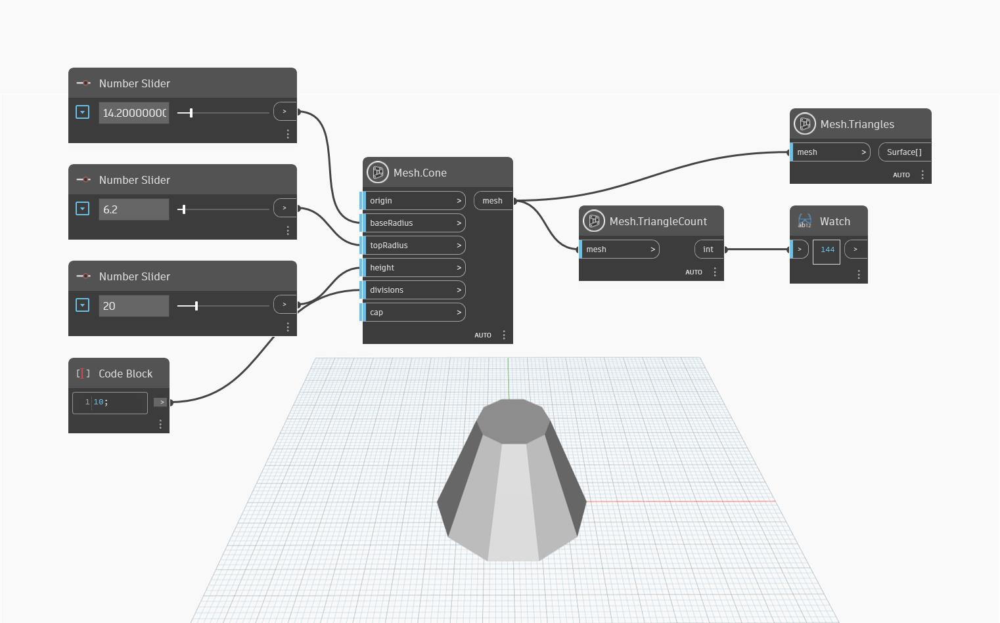

## 상세
`Mesh.TriangleCount`는 메쉬의 삼각형 수를 계산합니다. 아래 예제에서는 `Mesh.Cone` 및 `Number.Slider`를 사용하여 원추를 만들고 이를 삼각형을 계산하기 위한 입력으로 사용합니다. 이 외에도 `Mesh.Triangles`는 더 나은 미리보기를 위해 메쉬의 삼각형을 강조 표시하는 데 사용됩니다.

## 예제 파일

