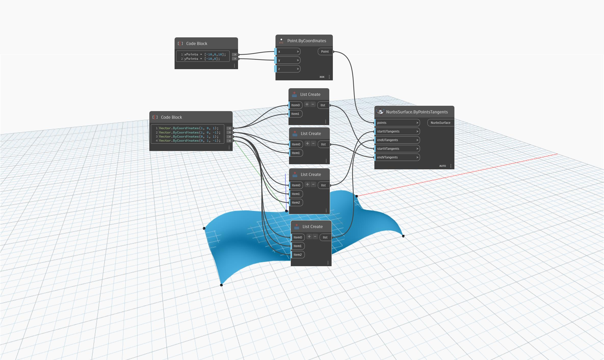

## 상세
`NurbsSurface.ByPointsTangents`는 점의 각 그리드(리스트의 리스트)를 통과하는 매끄러운 표면을 작성합니다. 접선 벡터를 지정하여 모서리의 표면 방향을 제어합니다. 접선 수는 해당 방향의 점 수(U - 리스트 수, V - 각 리스트의 점 수)와 일치해야 합니다.

아래 예에서는 지정된 점과 U 및 V 접선에서 NurbsSurface가 생성됩니다.

___
## 예제 파일

