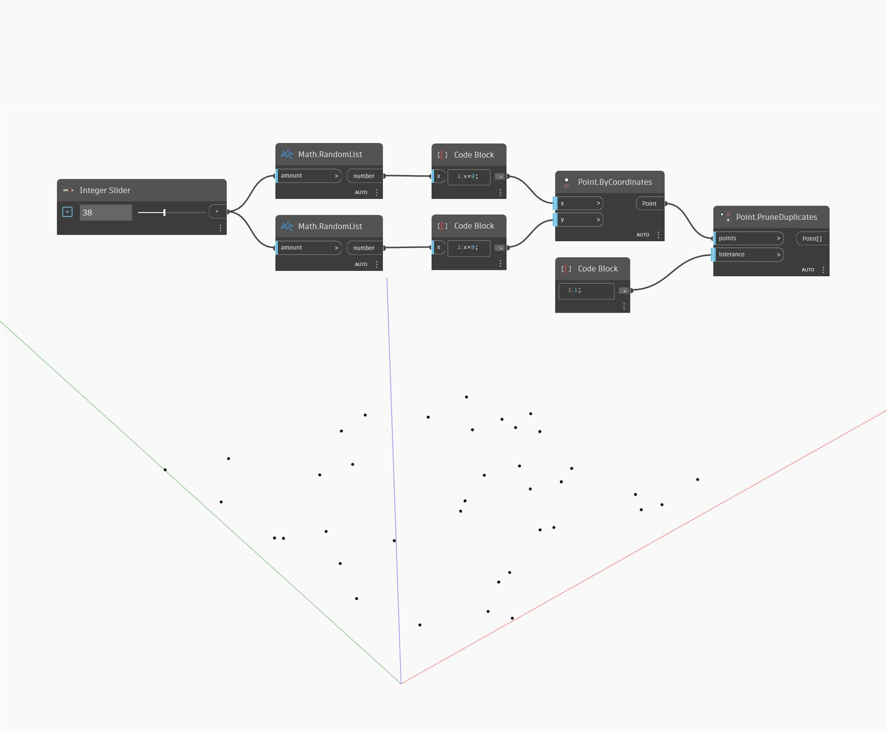

## 상세
Prune Duplicates는 점 리스트를 입력으로 사용하고 중복 점이 제거된 리스트를 반환합니다. 공차 입력은 두 점이 얼마나 가까울 때 중복 점으로 간주해야 하는지를 결정하는 데 사용됩니다. 두 점이 공차보다 가까운 경우 리스트의 첫 번째 점은 유지되고 다른 점은 제거됩니다. 이 예에서는 임의의 점 세트를 생성한 다음 공차가 1인 Prune Duplicates를 사용하여 다른 점에 1단위보다 가까운 모든 점을 제거합니다.
___
## 예제 파일

