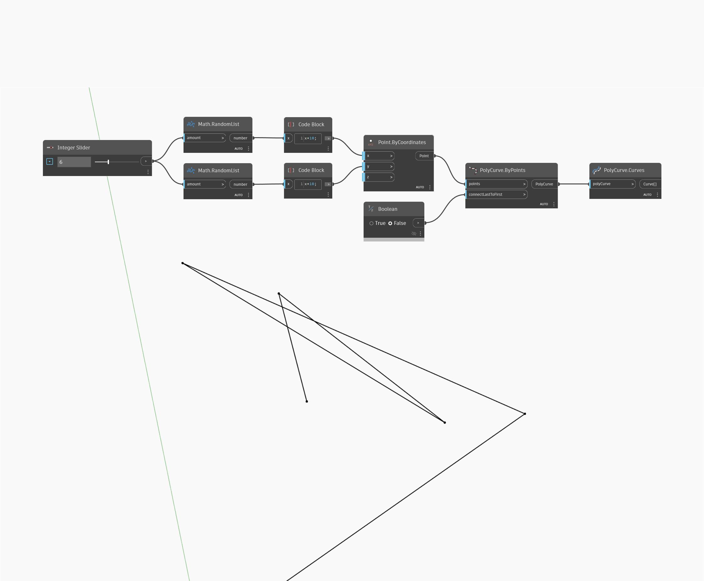

## 상세
`PolyCurve.Curves`는 입력 PolyCurve를 구성하는 개별 곡선의 리스트를 반환합니다.

아래 예에서는 임의의 점 세트를 생성한 다음 `PolyCurve.ByPoints`를 사용하여 열린 PolyCurve를 만듭니다. 그런 다음 `PolyCurve.Curves`를 사용하여 PolyCurve를 구성하는 개별 곡선의 리스트를 생성합니다.

___
## 예제 파일

