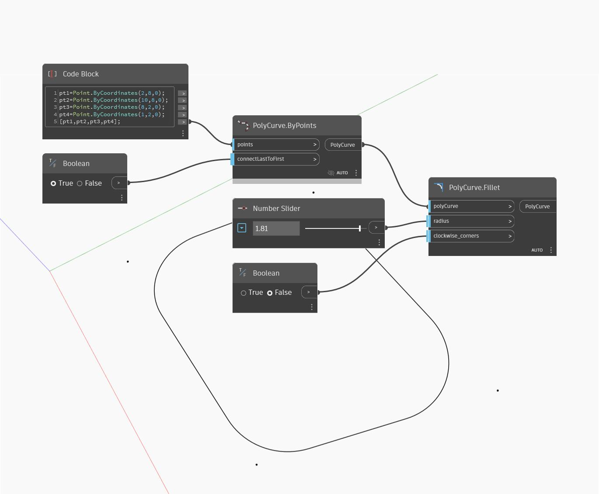

## 상세
Fillet은 모서리가 둥근 새 솔리드를 반환합니다. 모서리 입력은 모깎기할 모서리를 지정하는 반면, 간격띄우기 입력은 모깎기의 반지름을 결정합니다. 아래 예에서는 기본 입력을 사용하여 정육면체로 시작합니다. 정육면체의 적절한 모서리를 얻기 위해 먼저 정육면체를 분해하여 면을 표면 리스트로 가져옵니다. 그런 다음 Face.Edges 노드를 사용하여 정육면체의 모서리를 추출합니다. GetItemAtIndex를 사용하여 각 면의 첫 번째 모서리를 추출합니다. 숫자 슬라이더로 각 모깎기의 반지름을 제어합니다.
___
## 예제 파일

