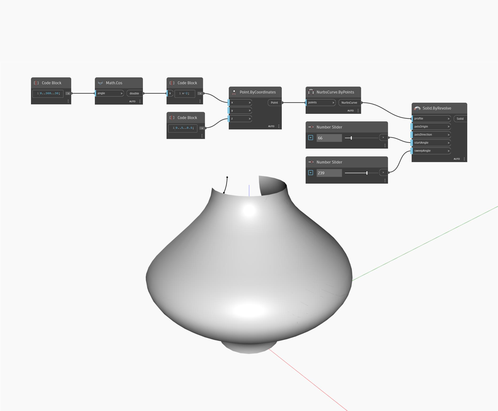

## 상세
`Solid.ByRevolve`는 축을 중심으로 지정된 프로파일 곡선을 회전시켜 표면을 만듭니다. 축은 `axisOrigin` 점과 `axisDirection` 벡터로 정의됩니다. 시작 각도는 표면을 시작할 위치(도 단위로 측정)를 결정하고 `sweepAngle`은 축을 중심으로 표면을 얼마나 멀리 계속할지를 결정합니다.

아래 예에서는 코사인 함수를 사용하여 생성한 곡선을 프로파일 곡선으로 사용하고, 두 개의 숫자 슬라이더를 사용하여 `startAngle` 및 `sweepAngle`을 제어합니다. 이 예에서는 `axisOrigin 및 `axisDirection`이 표준 원점 및 표준 Z축의 기본값으로 남아 있습니다.

___
## 예제 파일

