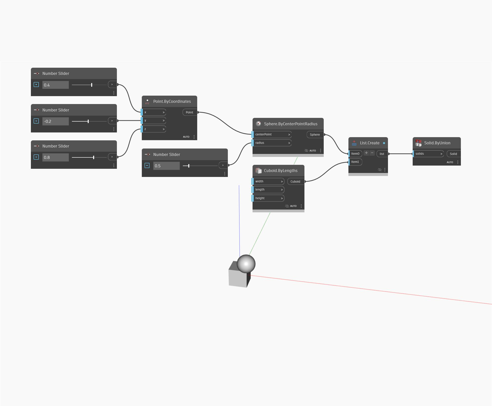

## 상세
Solid by Union은 닫힌 솔리드 리스트의 결합으로부터 새 단일 솔리드를 작성합니다. 결합은 두 솔리드의 조합이며 새 솔리드는 원래 솔리드의 모든 체적을 포함합니다. 아래 예에서는 숫자 슬라이더 세트를 사용하여 구의 위치와 반지름을 제어하고 기본 직육면체를 사용합니다. 또한 List.Create 노드를 사용하여 정육면체와 구를 모두 단일 리스트에 입력합니다. 이 리스트는 Solid ByUnion 노드의 입력으로 사용됩니다.
___
## 예제 파일

