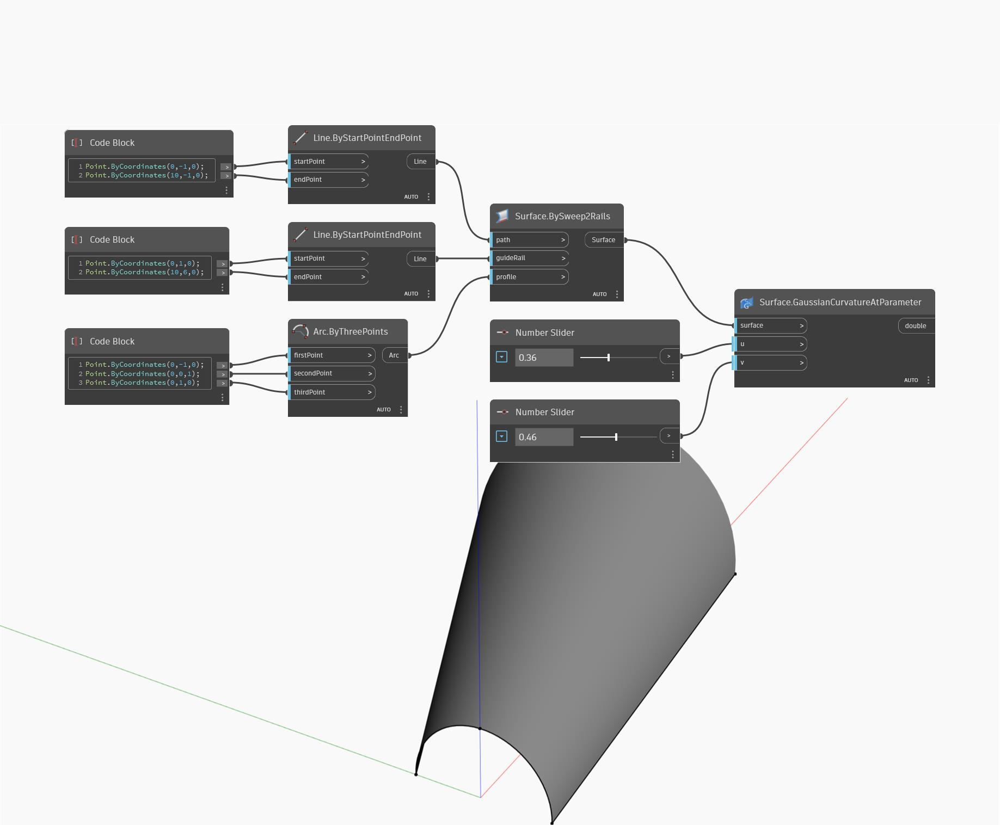

## 상세
Gaussian Curvature At Parameter는 U 및 V 입력 매개변수를 사용하고 표면의 입력 UV 위치에서 표면의 곡률을 반환합니다. 가우스 곡률은 U 및 V 방향에서 두 가지 주 곡률의 곱으로 계산됩니다. 아래 예에서는 먼저 BySweep2Rails를 사용하여 먼저 표면을 작성합니다. 그런 다음 숫자 슬라이더 두 개를 사용하여 U 및 V 매개변수를 결정하고 GaussianCurvatureAtParameter 노드로 가우스 곡률을 구합니다.
___
## 예제 파일

