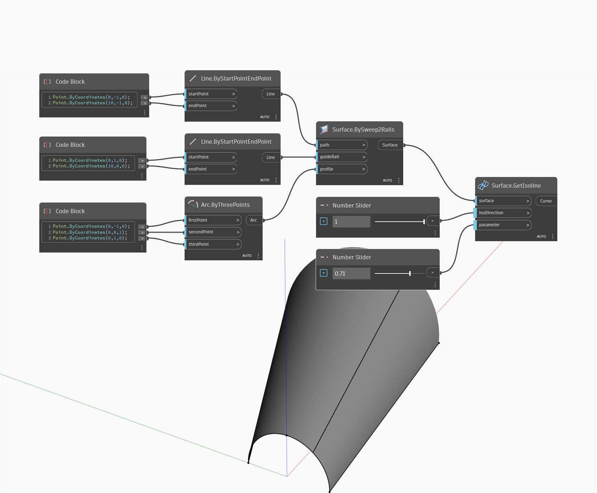

## 상세
Get Isoline은 입력 U 또는 V 매개변수에서 표면의 등치선을 반환합니다. 입력 isoDirection은 U 방향 또는 V 방향을 사용할지 여부를 결정하는 데 사용됩니다. isoDirection 0은 U 방향에 해당하고 isoDirection 1은 V 방향에 해당합니다. 아래 예에서는 먼저 BySweep2Rails를 사용하여 표면을 작성합니다. 그런 다음 숫자 슬라이더 두 개를 사용합니다. 첫 번째 슬라이더로 등치선의 U 또는 V 방향을 제어하고 두 번째 슬라이더로 등치선을 구하기 위한 매개변수를 결정합니다.
___
## 예제 파일

