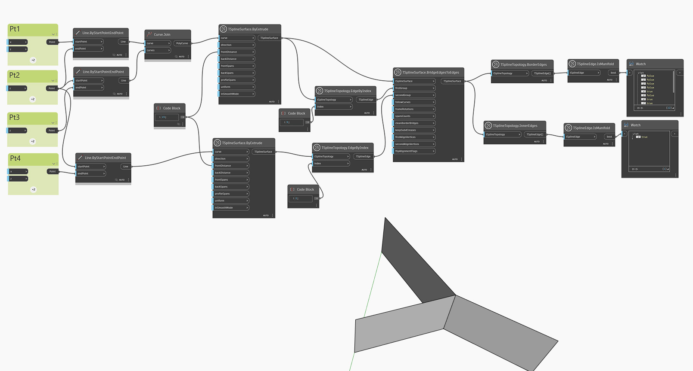

## In-Depth
아래 예에서는 비 매니폴드 모서리의 사례를 보여 주기 위해 표면이 내부 모서리를 공유하는 두 표면을 결합하여 생성됩니다. 결과적으로 명확한 전면 및 후면이 없는 표면이 생성됩니다. 비 매니폴드 표면은 복구될 때까지 상자 모드에서만 표시될 수 있습니다. 이 경우 `TSplineEdge.IsManifold 노드는 매니폴드에 해당하는 내부 및 경계 모서리를 강조 표시하는 데 사용됩니다.

## 예제 파일

