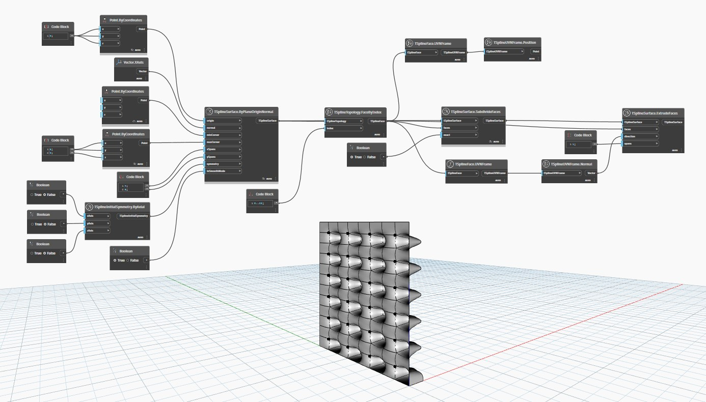

## 상세
아래 예에서는 `TSplineSurface.ByPlaneOriginNormal`을 사용하여 평면형 T-Spline 표면이 작성되고 해당 면 세트가 선택 및 세분화됩니다. 그런 다음 방향(이 경우 면의 UVN 법선 벡터)과 스팬 수가 제공되면 해당 면이 `TSplineSurface.ExtrudeFaces` 노드를 사용하여 대칭적으로 돌출됩니다. 결과 모서리는 지정된 방향으로 변위됩니다.
___
## 예제 파일

