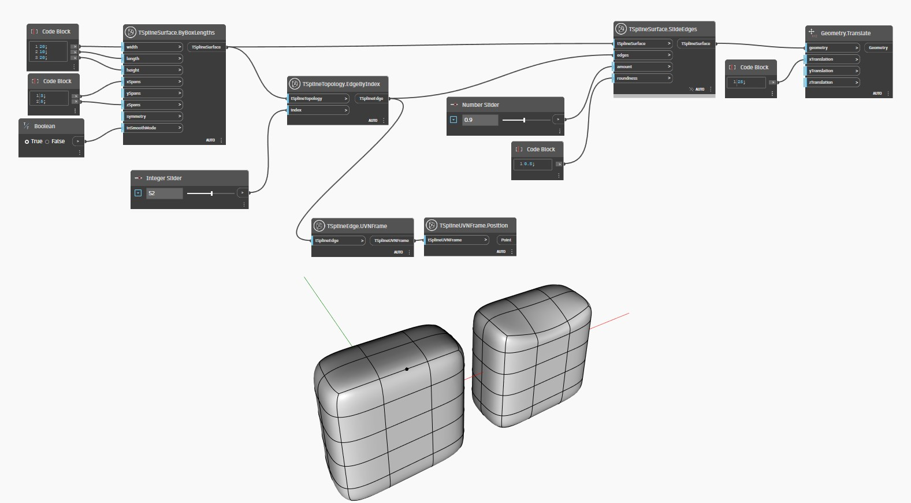

## 상세
아래 예에서는 단순한 T-Spline 상자 표면이 작성되고 해당 모서리 중 하나가 `TSplineTopology.EdgeByIndex` 노드를 사용하여 선택됩니다. 선택한 정점의 위치를 더 잘 이해할 수 있도록 해당 위치가 `TSplineEdge.UVNFrame` 및 `TSplineUVNFrame.Position` 노드를 통해 시각화됩니다. 선택한 모서리는 모서리가 속한 표면과 함께 `TSplineSurface.SlideEdges` 노드의 입력으로 전달됩니다. `amount` 입력은 모서리가 인접한 모서리로 슬라이딩되는 정도(퍼센트로 표시)를 결정합니다. `roundness` 입력은 베벨의 평평함 또는 둥글기를 제어합니다. 둥글기의 효과는 상자 모드에서 더 잘 이해할 수 있습니다. 그런 다음 슬라이딩 작업의 결과가 미리보기를 위해 측면으로 이동됩니다.

___
## 예제 파일

