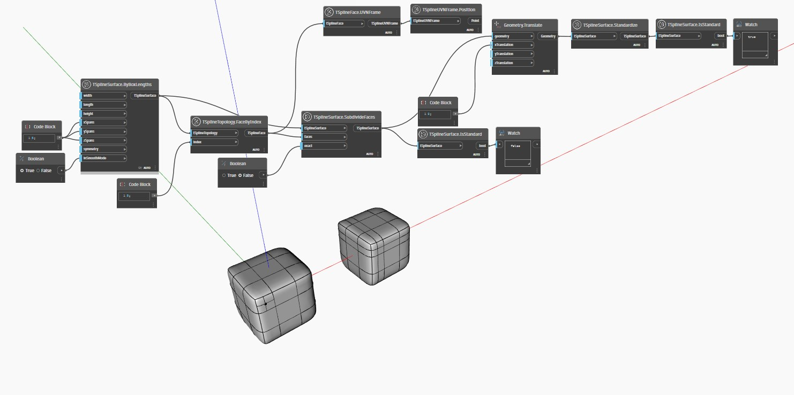

## 상세
`TSplineSurface.Standardimandary` 노드는 T-Spline 표면을 표준화하는 데 사용됩니다.
표준화란 NURBS 변환을 위해 T-Spline 표면을 준비하는 것을 의미하고, 둘 이상의 Iso 곡선으로 별 점에서 분리될 때까지 모든 T 점을 연장하는 것을 의미합니다. 표준화는 표면의 모양을 변경하지 않지만, 표면이 NURBS와 호환되게 하는 데 필요한 형상 요구 사항을 충족하도록 제어점을 추가할 수 있습니다.

아래 예에서는 `TSplineSurface.ByBoxLengthings`를 통해 생성된 T-Spline 표면에 세분화된 면 중 하나가 있습니다.
`TSplineSurface.IsStandard` 노드는 표면이 표준인지 확인하는 데 사용되지만 음수 결과를 생성합니다.
그런 다음 `TSplineSurface.Standardiz`는 표면을 표준화하는 데 사용됩니다. 결과 표면은 현재 표준인지 확인하는 `TSplineSurface.IsStandard`를 사용하여 확인됩니다.
The nodes `TSplineFace.UVNFrame` and `TSplineUVNFrame.Position` are used to highlight the subdivided face in the surface.
___
## 예제 파일

