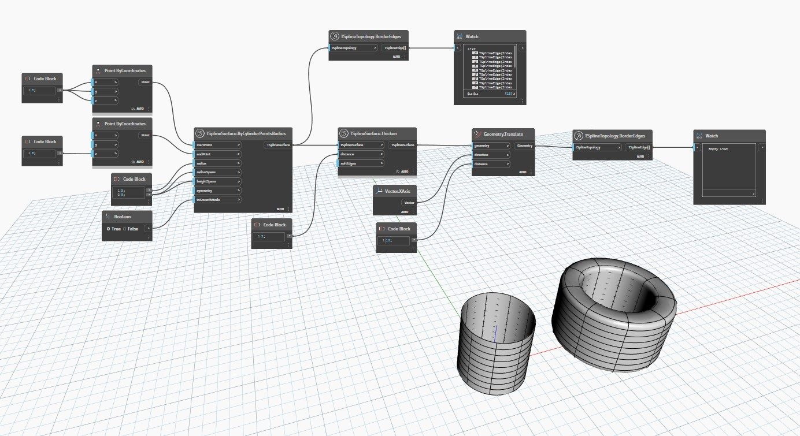

## 상세
`TSplineTopology.BorderEdges`는 T-Spline 표면에 포함된 경계 모서리 리스트를 반환합니다.

아래 예에서는 두 개의 T-Spline 표면이 `TSplineSurface.ByCylinderPointsRadius`를 통해 작성됩니다. 하나는 열린 표면이고 다른 하나는 `TSplineSurface.Thicken`을 사용하여 두꺼워진 표면인데, 여기서는 닫힌 표면으로 바뀝니다. 둘 다 `TSplineTopology.BorderEdges` 노드를 사용하여 검사되며, 첫 번째 표면은 경계 모서리 리스트를 반환하고 두 번째 표면은 빈 리스트를 반환합니다. 이는 표면이 둘러싸여 있고 경계 모서리가 없기 때문입니다.
___
## 예제 파일

