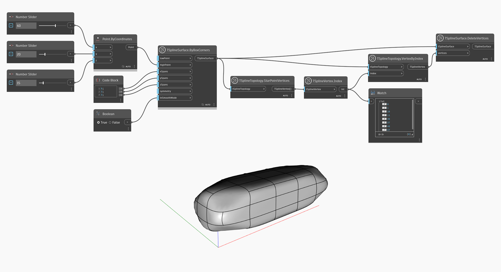

## In-Depth
`TSplineVertex.Index`는 T-Spline 표면에서 선택한 정점의 색인 번호를 반환합니다. T-Spline 표면 토폴로지에서 면, 모서리 및 정점의 색인이 리스트에 있는 항목의 시퀀스 번호와 일치하지는 않습니다. `TSplineSurface.CompressIndices` 노드를 사용하여 이 문제를 해결하십시오.

아래 예에서는 `TSplineTopology.StarPointVertices`가 상자 모양의 T-Spline 원형에서 사용됩니다. 그런 다음 `TSplineVertex.Index`가 별 점 정점의 색인을 쿼리하는 데 사용되고 `TSplineTopology.VertexByIndex`가 추가 편집을 위해 선택한 정점을 반환합니다.

## 예제 파일

