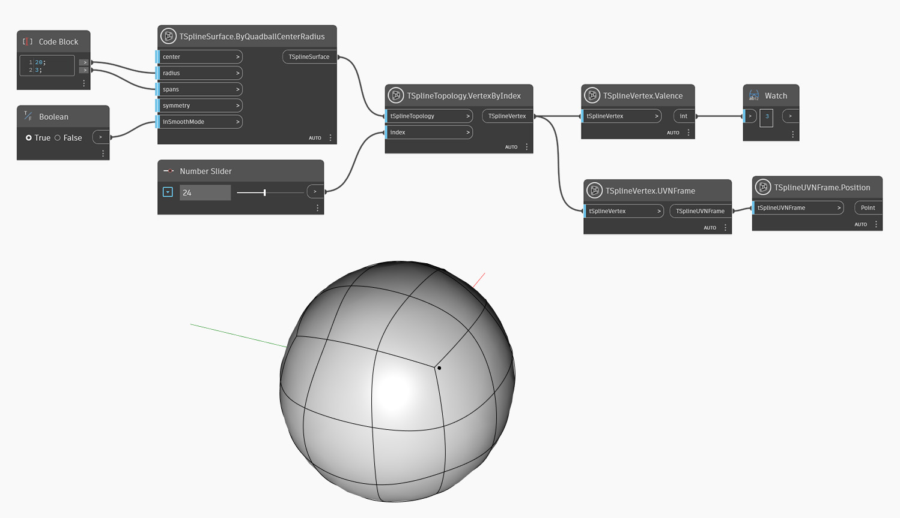

## In-Depth
`TSplineVertex.Valence`는 제어 메쉬의 정점에 연결된 모서리 수를 반환합니다. 정점의 Valence는 표면의 매끄러움과 모양에 영향을 줍니다.

아래 예에서는 `TSplineVertex.Valence` 노드가 원형 T-Spline 표면에 있는 정점의 Valence를 확인하는 데 사용됩니다. 선택한 정점의 Valence는 일부 별 점 및 T 점의 경우 "3"입니다. UVN 프레임은 검사할 정점의 위치를 시각화하는 데 사용됩니다.

## 예제 파일

