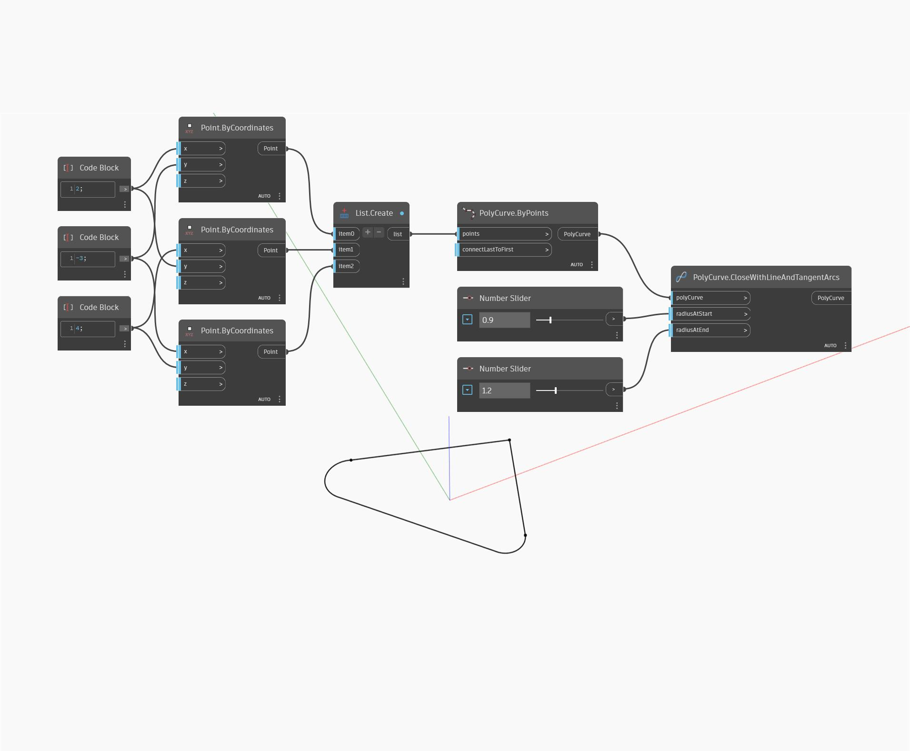

<!--- Autodesk.DesignScript.Geometry.PolyCurve.CloseWithLineAndTangentArcs --->
<!--- CT4U4755MIGFNI35WRSJ3HCWSD6YXTW5YXJUSHYG656EL5ROU3MQ --->
## 상세
CloseWithLineAndTangentArcs는 선 및 접하는 호를 반환하여 열린 PolyCurve를 닫습니다. 아래 예에서는 두 개의 세그먼트가 있는 PolyCurve가 선과 호로 닫힙니다. 호는 새 선의 시작 또는 끝에 있는지 여부에 따라 정의되며, 호의 반지름은 개별적으로 제어할 수 있습니다.
___
## 예제 파일

