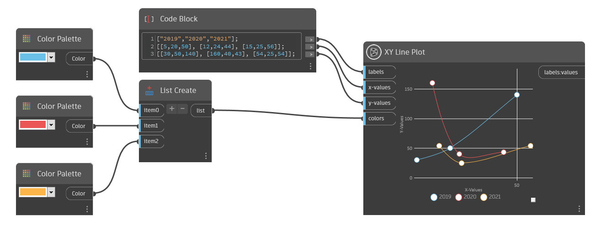

## 상세

XY 선 플롯은 하나 이상의 선이 x 및 y 값으로 플롯된 차트를 생성합니다. 레이블 입력에 문자열 레이블 리스트를 입력하여 선에 레이블을 지정하거나 선 수를 변경합니다. 각 레이블은 색상으로 구분된 새로운 선을 생성합니다. 하나의 문자열 값만 입력하면 하나의 선만 생성됩니다.

각 선을 따라 각 점의 배치를 결정하려면 x 및 y 값 입력에 double 값이 포함된 리스트의 리스트를 사용합니다. x 값과 y 값 입력에는 동일한 수의 값이 있어야 합니다. 또한 하위 리스트 수는 레이블 입력의 문자열 값 수와 일치해야 합니다.
예를 들어, 각각 5개의 점이 있는 3개의 선을 생성하려면 레이블 입력에 3개의 문자열 값이 있는 리스트를 입력하여 각 선의 이름을 지정하고 x 및 y 값 모두에 대해 각각 5개의 double 값이 있는 3개의 하위 리스트를 입력합니다.

각 선의 색상을 지정하려면 색상 입력에 색상 리스트를 삽입합니다. 사용자 지정 색상을 지정할 때 색상 수는 레이블 입력의 문자열 값 수와 일치해야 합니다. 색상을 지정하지 않으면 임의의 색상이 사용됩니다.

___
## 예제 파일

