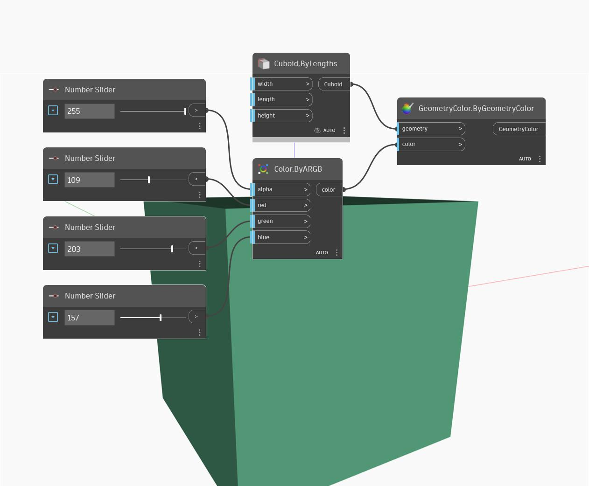

## 상세
ByARGB는 입력 Alpha, Red, Green 및 Blue 값을 사용하여 색상을 작성합니다. 입력 값의 범위는 0~255입니다. 아래 예에서는 0~255 범위로 설정된 숫자 슬라이더 4개를 사용하여 ByARGB 노드의 입력 값을 제어합니다. 결과 색상을 시각화하기 위해 기본 직육면체와 함께 Display.ByGeometryColor 노드를 사용합니다.
___
## 예제 파일

