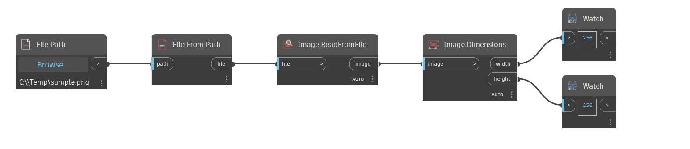

## 상세
Dimensions는 입력 이미지의 폭과 높이를 픽셀 단위로 반환합니다. 아래 예에서는 먼저 File Path 노드와 File.FromPath를 사용하여 이미지를 가리키는 파일 객체를 작성합니다. 그런 다음 Image.ReadFromFile을 사용하여 파일을 기반으로 이미지 객체를 작성합니다. Dimensions 노드는 이 이미지의 폭과 높이가 270픽셀임을 보여줍니다.
___
## 예제 파일

