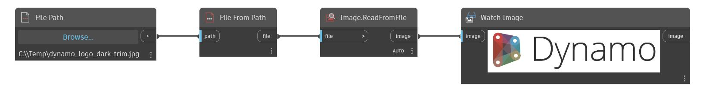

## 상세
Read From File은 파일을 입력으로 사용합니다. 파일은 쉼표로 구분된 데이터가 있는 텍스트 파일이어야 합니다. 파일 내의 여러 줄은 외부 리스트에 해당하고 각 줄의 개별 값은 내부 리스트에 해당합니다. 아래 예에서는 먼저 File Path 노드와 File.FromPath 노드를 사용하여 텍스트 파일을 가리키는 파일 객체를 작성합니다. 그런 다음 ReadFromFile 노드를 사용하여 CSV 파일에서 리스트를 작성합니다.
___
## 예제 파일

