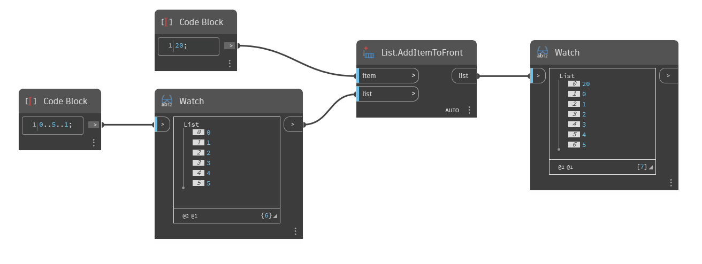

## 상세
'List.AddItemToFront'는 지정된 리스트의 앞에 지정된 항목을 삽입합니다. 새 항목의 색인은 0이고 원래 항목은 모두 색인 1만큼 이동됩니다. 추가할 항목이 리스트인 경우 리스트가 단일 객체로 추가되어 내포된 리스트가 생성됩니다. 두 리스트를 하나의 단순 리스트로 결합하려면 'List.Join'을 참고하십시오.

아래 예에서는 코드 블록을 사용하여 1씩 증감하는 0에서 5까지의 숫자 범위를 생성합니다. 그런 다음 'List.AddItemToFront'를 사용하여 해당 리스트의 앞에 번호가 20인 새 항목을 추가합니다.
___
## 예제 파일

