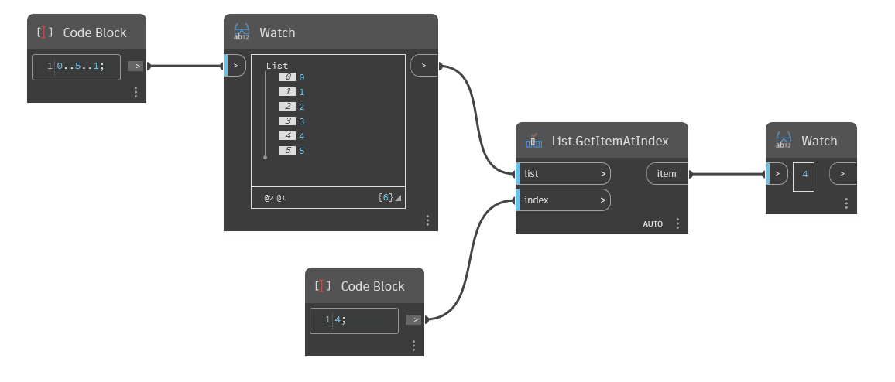

## 상세
'List.GetItemAtIndex'는 입력 리스트와 색인(정수)을 사용하고 지정된 색인에 있는 리스트의 항목을 반환합니다.

아래 예에서는 코드 블록을 사용하여 1씩 증감하는 0에서 5까지의 숫자 범위를 생성합니다. 그런 다음 'List.GetItemAtIndex' 노드를 사용하여 색인 4에서 단일 요소를 추출합니다.
___
## 예제 파일

