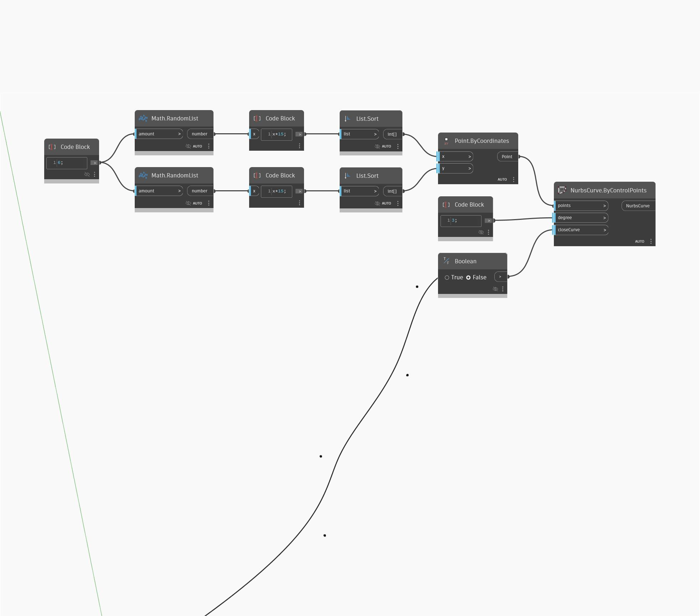

<!--- Autodesk.DesignScript.Geometry.NurbsCurve.ByControlPoints(points, degree, closeCurve) --->
<!--- EEK2MZQNIS3F4JP5TCEY6FFPZJ6INBUWD2P7FWPXS6O7IBVMTZCQ --->
## 상세
Nurbs Curve By Control Points는 제어점 리스트를 입력하여 Nurbs 곡선을 그립니다. Nurbs Curve By Control Points를 사용하면 곡선의 각도를 제어할 수도 있습니다. 또한 곡선을 리스트의 첫 번째 점으로 다시 닫을 수도 있습니다. 이 예에서는 표준 XY 평면에 임의의 점 4개를 생성하고 X 및 Y 방향으로 순서대로 연결합니다.
___
## 예제 파일

