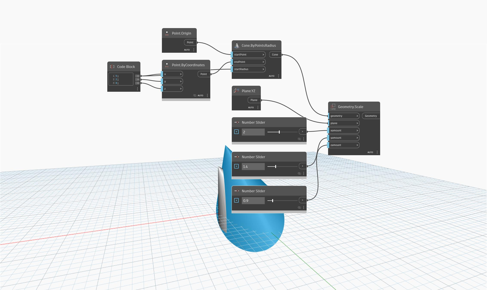

<!--- Autodesk.DesignScript.Geometry.Geometry.Scale(geometry, plane, xamount, yamount, zamount) --->
<!--- EWHQFBJJR5GL3IN7LJ7T7SOY4G24EIBASTHDIRIYQ27HIKC2MGYQ --->
## 상세
`Geometry.Scale (plane, xamount, yamount, zamount)`은 지정된 X, Y 및 Z 비율을 사용하여 평면을 중심으로 입력 형상의 축척을 조정합니다.

아래 예는 YZ 평면을 기준으로 축척이 조정되기 전과 후의 원추를 보여줍니다.

___
## 예제 파일

