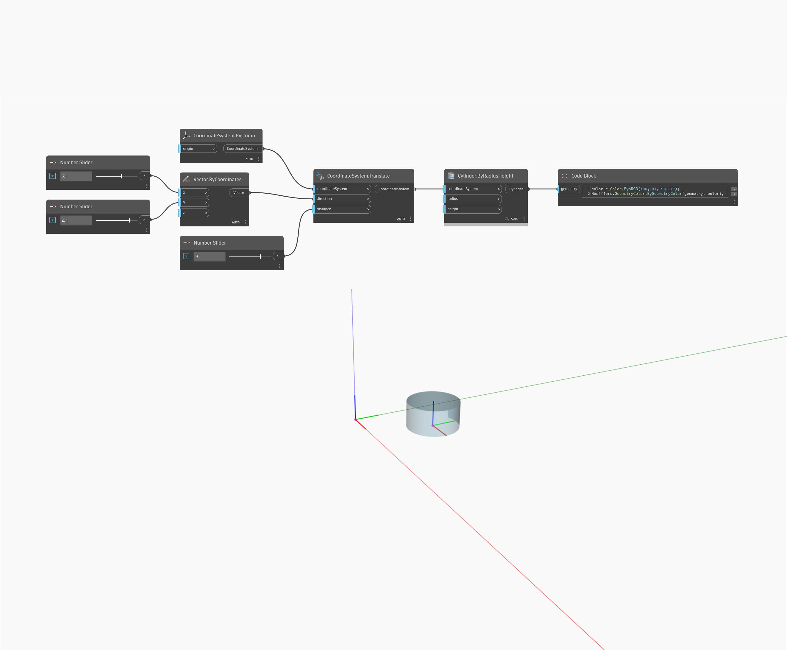

<!--- Autodesk.DesignScript.Geometry.CoordinateSystem.Translate(direction, distance) --->
<!--- G4FMYWTHURTGUOQQGRPIN6WMHT2BRYZXFVAJBYAUIIJQUAKWSY3Q --->
## 상세
CoordinateSystem 유형을 지정된 방향으로 지정된 거리만큼 변환합니다.
___
## 예제 파일

