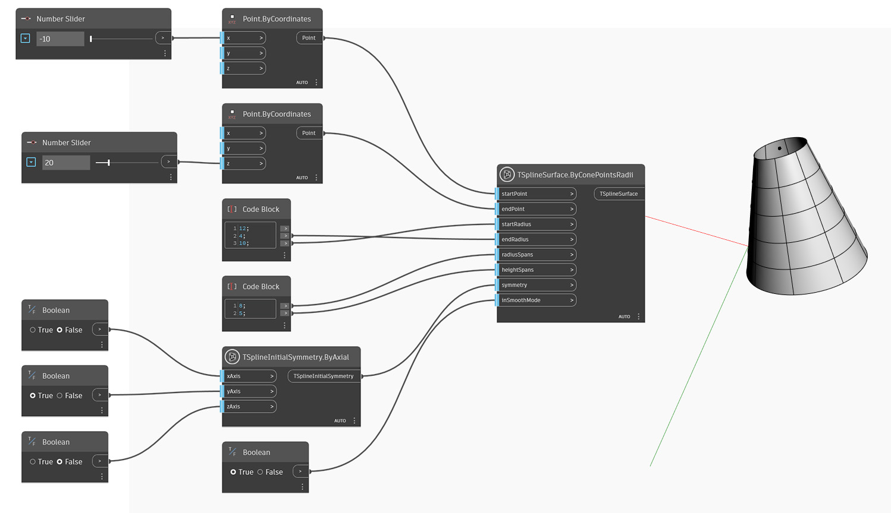

<!--- Autodesk.DesignScript.Geometry.TSpline.TSplineSurface.ByConePointsRadii --->
<!--- H54SEHAY3YGO3MOAVNNGUJ3QI6IP6X6CQRV54A3GDLT46TUD6UHA --->
## In-Depth
아래 예에서는 T-Spline 원뿔 원형이 `TSplineSurface.ByConePointsRadii` 노드를 사용하여 작성됩니다. 원뿔의 위치와 높이는 `startPoint` 및 `endPoint`의 두 입력으로 제어됩니다. 베이스 및 상단 반지름은 `startRadius` 및 `topRadius` 입력으로 조정될 수 있습니다. radialSpans` 및 `heightSpans`는 방사형 및 높이 스팬을 결정합니다. 모양의 초기 대칭은 `symmetry` 입력에 의해 지정됩니다. X 또는 Y 대칭이 True로 설정되면 방사형 스팬의 값이 4의 배수여야 합니다. 마지막으로 `SmoothMode` 입력이 T-Spline 표면의 매끄럽게 모드 미리보기와 상자 모드 미리보기 사이를 전환하는 데 사용됩니다.

## 예제 파일

